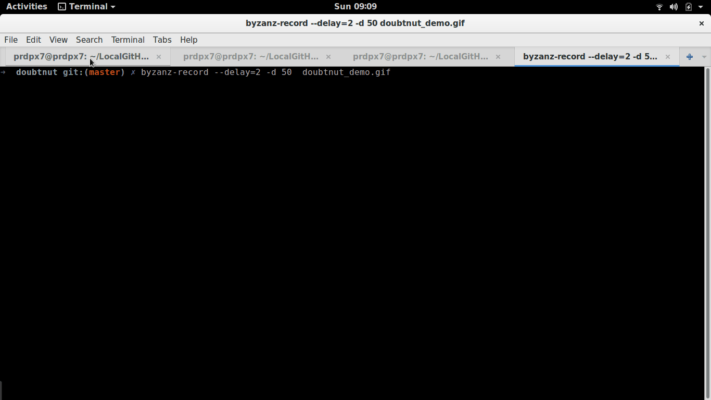

# doubtnut
> Upload your question, get similar questions (with explainer video) instantly

## Installation
* Make sure python-3.7 is installed in your system
* For debian based distros
```bash
sudo add-apt-repository ppa:deadsnakes/ppa
sudo apt-get update
sudo apt-get install python3-pip python3.7 python3.7-dev
```
* Setup instructions
```bash
git clone https://github.com/prdpx7/doubtnut.git
cd doubtnut/
virtualenv venv --python=/usr/bin/python3.7
source ./venv/bin/activate
pip install -r requirements.txt
# although, we never push db files into remote repository,
# but since it's for demo purpose
# you can skip below steps since, because all migrations are applied already 
# and db file is pushed into repo
python manage.py makemigrations
python manage.py migrate
```

* Running Server(s)
```bash
python manage.py runserver 8000
# open two new terminals
# on first terminal run
redis-server
# on second terminal, activate env and run
celery -A tasks worker -l info
```

## APIs

### Auth
* method - `POST`
* url - `http://localhost:8000/users/api/login/`
* payload - 
    ```json
    {"username":"<username", "password":<password>}
    ```
* Example -
    ```bash
    curl -X POST -d "username=admin&password=password@123" http://localhost:8000/users/api/login/
    # response:
    {"token":"eyJ0eXAiOiJKV1QiLCJhbGciOiJIUzI1NiJ9. eyJ1c2VyX2lkIjoyLCJ1c2VybmFtZSI6ImFkbWluIiwiZXhwIjoxNTkwMjg2ODQxLCJlbWFpbCI6ImFkbWluQGRvdWJ0bnV0LmNv bSIsIm9yaWdfaWF0IjoxNTg5NjgyMDQxfQ.UTWm2hnQIOrWxkRMLH2mpV6zqgoxEFU1fHBw0o5m-pw","user":{"id":2,  "type":"STAFF","first_name":"admin","last_name":"","email":"admin@doubtnut.com"}}
    ```

### Submit Quesion
* method - `POST`
* url - `http://localhost:8000/qna/api/user-asked-questions/`
* FormData - `image:<content>`
* Example - 
    ```bash
    curl -H "Content-Type: multipart/form-data" -H "Authorization: JWT <token>" \
    -F "image=@/home/prdpx7/prob_question.png" http://localhost:8000/qna/api/user-asked-questions/
    
    ```
* [prob_question.png](https://i.imgur.com/KCYWXU2.png)
<details><summary>Response</summary>

</details>

### Get Related Catalog Questions
* Note, we can consecutively make both call SubmitQuestion -> GetRelatedCatalogQuestion(one after another from front-end), from user perspective it'll just look like one step.
* method - `GET`
* url - `http://localhost:8000/qna/api/catalog-questions/?asked_question_id=<asked_question_id>`
* Example - 
    ```bash
    curl -H "Content-Type:application/json" -H "Authorization: JWT <token>" \ 
    http://localhost:8000/qna/api/catalog-questions/?asked_question_id=14
    ```

<details><summary>Response</summary>

</details>


### Create Catalog Question
* Only Staff User can access this API
* method - `POST`
* url - `http://localhost:8000/qna/api/catalog-questions/`
* payload - 
    ```json
        {
            "question":{
                "title":"...",
                "description":"...",
                "tags":[1,2,3]
            },
            "video_url":"https://www.youtube.com/watch?v=dQw4w9WgXcQ"
        }
    ``` 
* Example - 
    ```bash
    curl -H "Content-Type: application/json" -H "Authorization: JWT <token>" \
    --data '{"question":{"title":"Explain Derivatives?", "description":"The paradox of the derivative", "tags":[3,4]}, "video_url":"https://www.youtube.com/watch?v=9vKqVkMQHKk"}' \
    http://localhost:8000/qna/api/catalog-questions/

    ```
### Watch Catalog Question Video
* method - `PUT`
    <details>
    <summary>Why PUT?</summary>
    <p>
    GET request would have made sense if we just have to return the result without modifying table. since, we have to modify the view_count of catalog question & update user_activity, we will go with PUT request.
    <p>
    </details>

* url - `http://localhost:8000/qna/api/catalog-questions/<catalog-question-pk>/watch_video/`
* payload - 
    ```json
    {
        "asked_question_id":12,
        "trigger_email_on_inactivity": false
    }
    ```
* Example - 
    ```bash
    curl -X PUT -H "Content-Type:application/json" -H "Authorization: JWT <token>" \ 
    --data '{"asked_question_id":12}'  \
    http://localhost:8000/qna/api/catalog-questions/3/watch_video/
    ```
<details><summary>Response</summary>

</details>

### Send Email After 5 minutes of User InActivity
* method - `POST`
* url - `http://localhost:8000/qna/api/catalog-questions/send_mail_on_user_inactivity/`
* payload - 
    ```json
    {
        "asked_question_id":12, 
        "current_catalog_question_id":3
    }
    ```
* Example - 
    ```bash
    curl -X POST -H "Content-Type:application/json" -H "Authorization: JWT <token>" \
    --data '{"asked_question_id":12, "current_catalog_question_id":3}' \
    http://localhost:8000/qna/api/catalog-questions/send_mail_on_user_inactivity/
    ```
* You can look at all generated pdf for a particular user in `doubtnut/media/notifications/<user_id>/`
* [Generated PDF](./sample_generated_catalog.pdf)

## Admin Dashboard Demo

